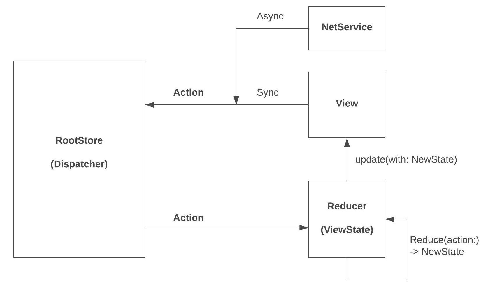

# SwiftUIRedux

[](https://github.com/Carthage/Carthage)

[](http://cocoapods.org/pods/ReactiveListViewKit)

### Comprehensive Redux library for SwiftUI.

 * Keep `State` consistent across `Stores` by type safe `pub/sub` pattern with `Reducers` of `RootStore`.
 * Waterfall `Action` propagation flow from root to `State` subtree.
  
### Unidirectional Data Flow
 * **RootStore/Dispatcher:** Propagates domained actions 

 * **Reducer:** Subscribes to `RootStore` and reduces `Action` to generate new state

 * **Action:** Action driven - more loosely coupled pattern than `Delegation` pattern
    
 * **State:**
   * Reduces `Action` and outputs new `State`
   * Waterfall reduce flow: propagates `Action` to children nodes via `State` tree
 
### Declarative/Stateful/Immutable/Predictable
  * Efficient tree diff algorithm, no more imperative manual update code. 



### Usage Example

***FeedListView***

```swift
struct FeedListView: View {
  @ObservedObject var state = FeedListState()
  
  var body: some View {
    List {
      ForEach(state.feeds, id: \.diffId) { feed in
        FeedCell(feed: feed)
      }
    }
  }
}

```

***FeedListState***

```swift
public class FeedListState: ReduxReducer, ObservableObject {  
  @Published var feeds: [Feed] = []
  
  public override func reduce(action: ReduxActionProtocol) {
    // Propagates `action` to the substate tree.
    // Setting `self.feeds` with new feeds triggers list UI reloading 
    // and SwiftUI will diff efficiently based on list identifier.
    feeds = feeds.map { $0.reduce(action: action) }
}
```

***Dispatch FeedLikeAction***

```swift
dispatch(action: FeedLikeAction(feed: feed))
```

***Reduce FeedLikeAction***

```swift
public struct Feed {
  public var diffId = UUID()
  public let feedId: Int
  public let title: String
  public var isLiked: Bool { didSet { diffId = UUID() } }     
}

extension Feed: ReduxStateProtocol {
  @discardableResult
  public func reduce(action: ReduxActionProtocol) -> Self {
    // Makes the deep copy of self.
    var feedCopy = self    
    switch action {
    case let action as FeedLikeAction:
      // Reduces the `FeedLikeAction`.
      if feedId == action.feed.feedId {
        feedCopy.isLiked = !action.feed.isLiked
      }
    default: break
    }
    return feedCopy
  }
}
```

