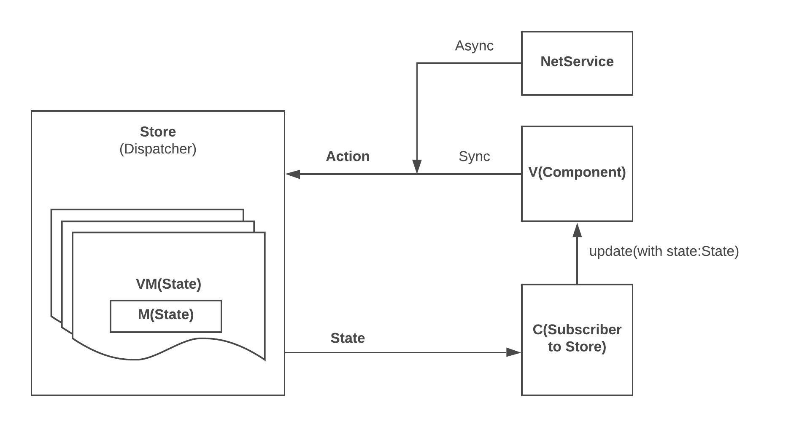

# SwiftUIRedux

### Comprehensive Redux library for SwiftUI.

 * Keep `State` consistent across features by `pub/sub` pattern with `reducers` of `RootStore`. 
 * Waterfall `Action` propagation flow from root to `State` subtree.
  
### Unidirectional Data Flow
 * **Dispatcher:** Propagates domained actions

 * **Store:** Maintains `State` tree

 * **Subscriber:** Subscribes to `Store` and updates Components with new `State`

 * **Action:** Action driven - more loosely coupled pattern than `Delegation` pattern
    
 * **State:**
   * Waterfall reacting flow
   * Composition: `RootState` is composed of `Substates`
   * Reacts to `Action` and outputs new `State`, propagates `Action` to children nodes via `State` tree

### Declarative/Stateful/Immutable/Predictable
  * Efficient ViewModel tree diff algorithm, no more imperative manual cells update code

  

### [Instagram Demo](https://github.com/showt1me/CZInstagram)
Implemented on top of **ReactiveListViewKit**

